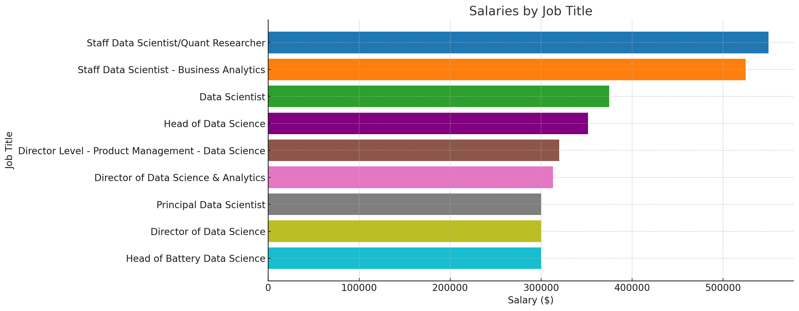

# Introduction
If you want to start a career in Data Science but don't know what skills to explore first, this project explores the top-paying jobs, in-demand skills, and where these both meet so that you can make an informed decision when starting your journey.

SQL queries? check them out here: [project_sql folder](/project_sql/)

# Background
When searching for the best way to learn Data Science and teach myself I came across Luke Barousse on YouTube and started to watch his video on [SQL for Data Analytics](https://www.youtube.com/watch?v=7mz73uXD9DA&t=11569s). I watched the entire video on my commutes to work and back, now I'm watching it for a second time and following along and I've learned so much.

### The Questions I Wanted To Answer Through These SQL Queries Were:

1. What are the top-paying Data Scientist Jobs?
2. What skills are required for those top-paying jobs?
3. What skills are most in demand for Data Scientists?
4. Which skills are associated with higher salaries?
5. What are the most optimal skills to learn?

# Tools I Used
For this project, I utilized the following
- **SQL**

- **PostgreSQL**

- **Visual Studio Code**

- **Git & GitHub**

# The Analysis
Each of the queries for this project was aimed to tackle specific aspects of the Data Scientist job market.

Here is how I approached each of the questions:
### 1. Top Paying Data Scientist Jobs
To Identify the highest-paying roles, I filtered data scientist jobs by their corresponding average yearly salary and location, focusing on remote jobs(Was originally going to do my home town but no salary data was in the data set.) With that, this query highlights the high-paying positions in the field.

```SQL
SELECT
 job_id,
 job_title,
 job_location,
 job_schedule_type,
 salary_year_avg,
 job_posted_date,
    name AS company_name
FROM
 job_postings_fact
LEFT JOIN company_dim ON job_postings_fact.company_id = company_dim.company_id
WHERE
 job_title_short = 'Data Scientist' AND
 job_location = 'Anywhere' AND
 salary_year_avg IS NOT NULL
ORDER BY 
 salary_year_avg DESC
LIMIT 
    10
```
Here is what the query shows

- **High Salaries:** The top 10 paid jobs show a range between $300,000 to $550,000, indicating potential salary in the field.

- **Diverse Employers:** Companies like Algo Capital Group, Reddit, and Selby Jennings are among those who are offering higher salaries in 2023.

- **Job Title Variety:** There were also different titles of jobs such as Head of Data Science, Principal Data Scientist, and Data Scientist just to name a few.


*ChatGPT generated this bar chart showing salaries by job title. Now, I'll generate a pie chart to visualize salary distribution.*
### 2. Skills For Top Paying Jobs
In this question, I uncovered the top skills in the Data science industry in the highest-paid roles.

```SQL

WITH top_paying_jobs AS (
    SELECT
 job_id,
 job_title,
 salary_year_avg,
        name AS company_name
    FROM
 job_postings_fact
    LEFT JOIN company_dim ON job_postings_fact.company_id = company_dim.company_id
    WHERE
 job_title_short = 'Data Scientist' AND
 job_location = 'Anywhere' AND
 salary_year_avg IS NOT NULL
    ORDER BY 
 salary_year_avg DESC
    LIMIT 
        10
)

SELECT 
 top_paying_jobs.*,
 skills
FROM 
 top_paying_jobs
INNER JOIN skills_job_dim on top_paying_jobs.job_id = skills_job_dim.job_id
INNER JOIN skills_dim ON skills_job_dim.skill_id = skills_dim.skill_id
ORDER BY 
 salary_year_avg DESC
    
```
Here's the breakdown of the most demanded skills for the top 10 highest-paying data scientist jobs in 2023:
- **SQL** is leading with **Python** at a count of 4.

Other skills like **R**, **Tableau**, **Pandas**, and **Excel** show varying degrees of demand.

### 3. Skills In-Demand For Data Science

This query helped to identify the skills most frequently requested in postings regardless of the yearly pay.

```SQL
SELECT 
 skills,
    COUNT(skills_job_dim.job_id) AS demand_count
FROM job_postings_fact
INNER JOIN skills_job_dim on job_postings_fact.job_id = skills_job_dim.job_id
INNER JOIN skills_dim ON skills_job_dim.skill_id = skills_dim.skill_id
WHERE
 job_title_short = 'Data Scientist' AND
 job_work_from_home = TRUE
GROUP BY
 skills
ORDER BY
 demand_count DESC
LIMIT 5
```
This is the breakdown of the most in-demand skills for data scientists in 2023

- Python leads the pack as the most in-demand skill for data science roles, with this plus other skills like SQL anything is possible.

- The fundamentals of SQL and Excel are not as in-demand however SQL is in the number two spot so it is still a good fundamental skill to keep to use with other skills.

|Skills |Demand Count|
|-------|------------|
|Python |10390       |
|SQL    |7488        |
|R      |4674        |
|AWS    |2593        |
|Tableau|2458        |

*Table of the demand for the top 5 skills in data analyst job postings*

### 4. Skills Based On Salary

This next one was difficult to get my head with this query that displays the highest paid skills based on the average salaries associated.

```SQL
SELECT 
 skills,
    ROUND(AVG(salary_year_avg), 0) AS avg_salary
FROM job_postings_fact
INNER JOIN skills_job_dim on job_postings_fact.job_id = skills_job_dim.job_id
INNER JOIN skills_dim ON skills_job_dim.skill_id = skills_dim.skill_id
WHERE
 job_title_short = 'Data Scientist'
    AND salary_year_avg IS NOT NULL
    AND job_work_from_home = TRUE
GROUP BY
 skills
ORDER BY
 avg_salary DESC
LIMIT 25
```
The following are the top ten average salary skills, most of them I personally haven't heard of but these must be niche skills that offer more in their respective fields.

|Skills |  Average Salary ($)|
|-------|--------------------|
|GDPR     |217,738
|Golang   |208,750
|Atlassian|189,700
|Selenium   |180,000
|OpenCV |172,500
|Neo4j  |171,655
|MicroStrategy  |171,147
|DynamoDB   |169,670
|PHP    |168,125
|Tidyverse  |165,513


### 5. Most Optimal Skills to Learn

Now we combine the insights from salary data and the demand together to establish the Most Optimal skills to learn for a data Scientist role in 2023:

```SQL
WITH skills_demand AS (
    SELECT 
        skills_dim.skill_id,
        skills_dim.skills,
        COUNT(skills_job_dim.job_id) AS demand_count
    FROM job_postings_fact
    INNER JOIN skills_job_dim on job_postings_fact.job_id = skills_job_dim.job_id
    INNER JOIN skills_dim ON skills_job_dim.skill_id = skills_dim.skill_id
    WHERE
        job_title_short = 'Data Scientist' 
        AND job_work_from_home = TRUE
        AND salary_year_avg IS NOT NULL
    GROUP BY
        skills_dim.skill_id
),

average_salary AS (
    SELECT 
        skills_job_dim.skill_id,
        ROUND(AVG(job_postings_fact.salary_year_avg), 0) AS avg_salary
    FROM 
        job_postings_fact
    INNER JOIN skills_job_dim on job_postings_fact.job_id = skills_job_dim.job_id
    INNER JOIN skills_dim ON skills_job_dim.skill_id = skills_dim.skill_id
    WHERE
        job_title_short = 'Data Scientist'
        AND salary_year_avg IS NOT NULL
        AND job_work_from_home = TRUE
    GROUP BY
        skills_job_dim.skill_id
)

SELECT 
    skills_demand.skill_id,
    skills_demand.skills,
    demand_count,
    avg_salary
FROM
    skills_demand
INNER JOIN average_salary ON skills_demand.skill_id = average_salary.skill_id
WHERE demand_count > 10
ORDER BY
    demand_count DESC,
    avg_salary DESC
limit 25

```
|skill_id|skills|demand_count|avg_salary|
|--------|------|------------|----------|
1|python|763|143828|
0|sql|591|142833|
5|r|394|137885|
182|tableau|219|146970
76|aws|217|149630
92|spark|149|150188
99|tensorflow|126|151536
74|azure|122|142306
101|pytorch|115|152603
93|pandas|113|144816
7|sas|110|129920
186|sas|110|129920
97|hadoop|82|143322
106|scikit-learn|81|148964
181|excel|77|129224|

*Table of the most optimal skills for data analyst sorted by salary*

Here's a breakdown of the most optimal skills for Data Scientist in 2023: 
- **High-Demand Programming Languages:** Python and SQL stand out for their high demand, with demand counts of 763 and 591 respectively. Despite their high demand, their average salaries are around $143,800 for Python and $142,800 for SQL, indicating that proficiency in these languages is highly valued but also widely available.
- **Cloud Tools and Technologies:** Skills in specialized technologies such as Snowflake, Azure, AWS, and BigQuery show significant demand with relatively high average salaries, pointing towards the growing importance of cloud platforms and big data technologies in data analysis.
- **Business Intelligence and Visualization Tools:** Tableau, with demand count of 230 and average salary around $147,000, highlight the critical role of data visualization and business intelligence in deriving actionable insights from data.
- **Database Technologies:** The demand for skills in traditional and NoSQL databases (Oracle, SQL Server, NoSQL) with average salaries ranging from $97,786 to $104,534, reflects the enduring need for data storage, retrieval, and management expertise.


# What I learned
# Conclusions
